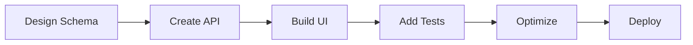
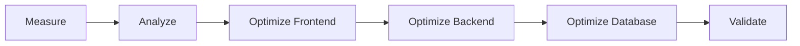
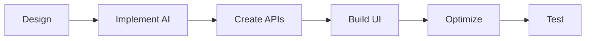
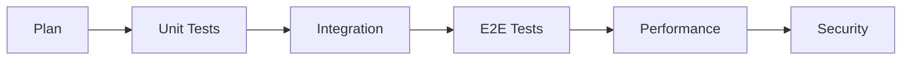

# Strive Tech Agents Handbook
*Comprehensive guide for leveraging Claude Code agents in the Strive Tech website project*
*40 relevant agents selected for this project (from 80+ available)*

## ⚡ Parallel Execution Support
**Agents CAN run in parallel!** Use the `+` operator or `&&` to execute multiple agents simultaneously:
```bash
# Parallel execution example
Task frontend-developer "Build UI" + Task backend-architect "Design API"
# Or use && for batch execution
Task performance-engineer "Analyze" && Task database-optimizer "Optimize"
```

---

## 📋 Table of Contents
1. [Project Context](#project-context)
2. [Relevant Agents Catalog](#relevant-agents-catalog)
3. [Custom Slash Commands](#custom-slash-commands)
4. [Agentic Workflows](#agentic-workflows)
5. [Quick Reference Guide](#quick-reference-guide)
6. [Next.js Migration Strategy](#nextjs-migration-strategy)
7. [Dashboard Development Playbook](#dashboard-development-playbook)

---

## 🎯 Project Context

**Current Stack:**
- Frontend: React 19 + TypeScript + Vite + Tailwind CSS + Wouter
- Backend: Express.js + Node.js 22 + PostgreSQL (Supabase) + Drizzle ORM
- UI: Radix UI + shadcn/ui components
- Testing: Vitest + Playwright
- Deployment: Vercel

**Upcoming Changes:**
- Migration to Next.js 15 (App Router)
- User authentication system
- Admin dashboard with analytics
- User dashboard with service management
- Enhanced AI feature integration

---

## 🤖 Relevant Agents Catalog

### Frontend Development

#### `frontend-developer`
**Use for:** React components, responsive layouts, state management
**Best for:** Creating new UI components, fixing frontend issues, implementing user interactions
**Example:** `Task frontend-developer "Create a responsive pricing table component with annual/monthly toggle"`

#### `typescript-pro`
**Use for:** Advanced TypeScript patterns, type safety, generics
**Best for:** Complex type systems, type inference optimization, strict typing
**Example:** `Task typescript-pro "Implement proper TypeScript types for the API response handlers"`

#### `ui-ux-designer`
**Use for:** Design systems, wireframes, accessibility standards
**Best for:** Creating new layouts, improving UX, design tokens
**Example:** `Task ui-ux-designer "Design the user dashboard layout with mobile-first approach"`

#### `ui-visual-validator`
**Use for:** Visual testing, design compliance, screenshot validation
**Best for:** Verifying UI changes, visual regression testing
**Example:** `Task ui-visual-validator "Verify the new contact form renders correctly across breakpoints"`

### Mobile & Responsive Development

#### `mobile-developer`
**Use for:** PWA features, mobile optimization, touch interactions, viewport handling
**Best for:** Mobile-first responsive design, performance on mobile devices, offline capabilities
**Example:** `Task mobile-developer "Optimize dashboard for mobile devices with touch gestures"`

#### `mobile-security-coder`
**Use for:** Mobile web security, secure WebView patterns, mobile-specific vulnerabilities
**Best for:** PWA security, mobile browser security headers, secure local storage on mobile
**Example:** `Task mobile-security-coder "Implement secure offline storage for PWA"`

### Backend Development

#### `backend-architect`
**Use for:** REST API design, microservice boundaries, database schemas
**Best for:** Creating new APIs, system architecture decisions
**Example:** `Task backend-architect "Design the user authentication API with JWT tokens"`

#### `database-optimizer`
**Use for:** Query optimization, indexing, performance tuning
**Best for:** Slow queries, database performance issues
**Example:** `Task database-optimizer "Optimize the service_requests table queries"`

#### `sql-pro`
**Use for:** Complex SQL queries, stored procedures, migrations
**Best for:** Data analysis, reporting queries, schema changes
**Example:** `Task sql-pro "Create analytics queries for admin dashboard metrics"`

#### `fastapi-pro`
**Use for:** API patterns, async endpoints, validation (applicable to Express.js)
**Best for:** Creating robust API endpoints with proper validation
**Example:** `Task fastapi-pro "Implement rate limiting and request validation for contact API"`

### Testing & Quality

#### `test-automator`
**Use for:** Test strategy, E2E tests, unit tests
**Best for:** Setting up test suites, coverage improvement
**Example:** `Task test-automator "Create E2E tests for user registration flow"`

#### `debugger`
**Use for:** Bug fixes, error analysis, root cause identification
**Best for:** Solving production issues, test failures
**Example:** `Task debugger "Fix the TypeScript compilation errors in server/routes"`

#### `code-reviewer`
**Use for:** Code quality, security issues, best practices
**Best for:** PR reviews, code audits, refactoring suggestions
**Example:** `Task code-reviewer "Review the email service implementation for security issues"`

### DevOps & Performance

#### `deployment-engineer`
**Use for:** CI/CD pipelines, Vercel configuration, deployment automation
**Best for:** Deployment issues, GitHub Actions, build optimization
**Example:** `Task deployment-engineer "Setup staging environment on Vercel"`

#### `performance-engineer`
**Use for:** Core Web Vitals, bundle optimization, caching strategies
**Best for:** Performance issues, load time optimization
**Example:** `Task performance-engineer "Optimize the homepage load time to under 2 seconds"`

#### `cloud-architect`
**Use for:** Infrastructure design, scalability planning, cost optimization
**Best for:** Architecture decisions, multi-region setup
**Example:** `Task cloud-architect "Design scalable infrastructure for 10x traffic growth"`

### Security

#### `security-auditor`
**Use for:** Security vulnerabilities, OWASP compliance, penetration testing
**Best for:** Security audits, compliance checks
**Example:** `Task security-auditor "Audit the application for OWASP Top 10 vulnerabilities"`

#### `frontend-security-coder`
**Use for:** XSS prevention, CSP headers, client-side security
**Best for:** Securing forms, input validation, sanitization
**Example:** `Task frontend-security-coder "Implement XSS protection for all user inputs"`

#### `backend-security-coder`
**Use for:** API security, authentication, authorization
**Best for:** Securing endpoints, JWT implementation, rate limiting
**Example:** `Task backend-security-coder "Implement secure password reset flow"`

### AI/ML Integration

#### `ai-engineer`
**Use for:** LLM integration, RAG systems, chatbots
**Best for:** AI features, vector search, agent orchestration
**Example:** `Task ai-engineer "Implement AI-powered support chatbot with context awareness"`

#### `prompt-engineer`
**Use for:** Prompt optimization, LLM performance, system prompts
**Best for:** Improving AI responses, reducing costs
**Example:** `Task prompt-engineer "Optimize prompts for the service recommendation engine"`

### Content & Documentation

#### `seo-content-writer`
**Use for:** Blog posts, landing pages, SEO-optimized content
**Best for:** Creating marketing content, case studies
**Example:** `Task seo-content-writer "Write a blog post about AI automation in logistics"`

#### `api-documenter`
**Use for:** OpenAPI specs, API documentation, developer guides
**Best for:** Documenting endpoints, SDK generation
**Example:** `Task api-documenter "Create OpenAPI documentation for all REST endpoints"`

### Research & Troubleshooting

#### `search-specialist`
**Use for:** Deep research, best practices discovery, troubleshooting edge cases
**Best for:** Finding solutions to complex problems, competitive analysis, technology research
**Example:** `Task search-specialist "Research best practices for Next.js 15 migration patterns"`

---

## 🚀 Custom Slash Commands

### `/strive-component`
**Purpose:** Create a full-stack component with UI, API endpoint, and database integration
**Agents Used:** frontend-developer, mobile-developer, backend-architect, database-optimizer, typescript-pro
**Usage:** `/strive-component "user profile card with edit capability"`
```bash
# Workflow:
1. frontend-developer creates React component
2. mobile-developer ensures mobile responsiveness
3. typescript-pro adds proper typing
4. backend-architect designs API endpoint
5. database-optimizer creates efficient queries
```

### `/strive-nextjs`
**Purpose:** Assist with Next.js migration tasks
**Agents Used:** frontend-developer, typescript-pro, deployment-engineer
**Usage:** `/strive-nextjs "migrate contact page to app router"`
```bash
# Workflow:
1. frontend-developer converts component to Next.js
2. typescript-pro ensures type safety
3. deployment-engineer updates build configuration
```

### `/strive-dashboard`
**Purpose:** Build dashboard features for admin or users
**Agents Used:** frontend-developer, ui-ux-designer, backend-architect, sql-pro
**Usage:** `/strive-dashboard "analytics widget showing weekly user signups"`
```bash
# Workflow:
1. ui-ux-designer creates wireframe
2. sql-pro writes analytics queries
3. backend-architect creates API endpoints
4. frontend-developer builds components
```

### `/strive-optimize`
**Purpose:** Comprehensive performance optimization
**Agents Used:** performance-engineer, frontend-developer, mobile-developer, database-optimizer
**Usage:** `/strive-optimize "improve page load speed"`
```bash
# Workflow:
1. performance-engineer analyzes bottlenecks
2. frontend-developer implements lazy loading
3. mobile-developer optimizes for mobile devices
4. database-optimizer improves query performance
```

### `/strive-test`
**Purpose:** Create comprehensive test coverage
**Agents Used:** test-automator, debugger, code-reviewer
**Usage:** `/strive-test "user authentication flow"`
```bash
# Workflow:
1. test-automator creates test plan
2. test-automator implements unit tests
3. test-automator creates E2E tests
4. debugger fixes any failing tests
```

### `/strive-deploy`
**Purpose:** Deployment preparation and validation
**Agents Used:** deployment-engineer, security-auditor, performance-engineer
**Usage:** `/strive-deploy "prepare for production release"`
```bash
# Workflow:
1. security-auditor runs security checks
2. performance-engineer validates performance
3. deployment-engineer configures deployment
```

### `/strive-ai`
**Purpose:** Implement AI-powered features
**Agents Used:** ai-engineer, prompt-engineer, frontend-developer, backend-architect
**Usage:** `/strive-ai "smart content recommendations"`
```bash
# Workflow:
1. ai-engineer designs AI architecture
2. prompt-engineer optimizes prompts
3. backend-architect creates API integration
4. frontend-developer builds UI
```

### `/strive-security`
**Purpose:** Security audit and hardening
**Agents Used:** security-auditor, frontend-security-coder, backend-security-coder, mobile-security-coder
**Usage:** `/strive-security "audit and fix authentication system"`
```bash
# Workflow:
1. security-auditor identifies vulnerabilities
2. backend-security-coder fixes API security
3. frontend-security-coder implements client security
4. mobile-security-coder secures mobile web experience
```

### `/strive-email`
**Purpose:** Email template and service development
**Agents Used:** frontend-developer, backend-architect, ui-ux-designer
**Usage:** `/strive-email "welcome email sequence"`
```bash
# Workflow:
1. ui-ux-designer designs email template
2. frontend-developer creates HTML template
3. backend-architect implements sending logic
```

### `/strive-seo`
**Purpose:** SEO and content optimization
**Agents Used:** seo-content-writer, seo-meta-optimizer, frontend-developer
**Usage:** `/strive-seo "optimize service pages for search"`
```bash
# Workflow:
1. seo-meta-optimizer analyzes current SEO
2. seo-content-writer improves content
3. frontend-developer implements structured data
```

---

## 🔄 Agentic Workflows

### Execution Patterns
- **Sequential**: `agent1 → agent2 → agent3` (when tasks depend on each other)
- **Parallel**: `agent1 + agent2 + agent3` (when tasks are independent)
- **Mixed**: `agent1 → (agent2 + agent3) → agent4` (analyze, parallel fix, validate)

### 1. Next.js Migration Workflow
**Goal:** Systematically migrate from Vite to Next.js 15


**Agents Sequence:**
1. `architect-review` - Analyze current architecture
2. `frontend-developer` - Setup Next.js project structure
3. `typescript-pro` - Migrate TypeScript configurations
4. `frontend-developer` - Convert pages to app router
5. `test-automator` - Update tests for Next.js
6. `deployment-engineer` - Configure Vercel for Next.js

### 2. Dashboard Implementation Workflow
**Goal:** Build complete admin and user dashboards


**Agents Sequence:**
1. `business-analyst` - Define KPIs and metrics
2. `ui-ux-designer` - Create dashboard wireframes
3. `sql-pro` - Design analytics queries
4. `backend-architect` - Build dashboard APIs
5. `frontend-developer` - Implement dashboard UI
6. `test-automator` - Create dashboard tests

### 3. Full-Stack Feature Workflow
**Goal:** Implement complete features from database to UI


**Agents Sequence:**
1. `database-optimizer` - Design database schema
2. `backend-architect` - Create REST endpoints
3. `typescript-pro` - Define types and interfaces
4. `frontend-developer` - Build React components
5. `test-automator` - Write comprehensive tests
6. `performance-engineer` - Optimize performance
7. `deployment-engineer` - Deploy to production

### 4. Performance Optimization Workflow
**Goal:** Achieve optimal Core Web Vitals scores


**Agents Sequence:**
1. `performance-engineer` - Measure current performance
2. `performance-engineer` - Identify bottlenecks
3. `frontend-developer` - Implement lazy loading, code splitting
4. `mobile-developer` - Optimize mobile performance and touch interactions
5. `backend-architect` - Optimize API responses
6. `database-optimizer` - Improve query performance
7. `performance-engineer` - Validate improvements

### 5. Security Hardening Workflow
**Goal:** Implement comprehensive security measures


**Agents Sequence:**
1. `security-auditor` - Run security audit
2. `frontend-security-coder` - Fix XSS, CSRF vulnerabilities
3. `backend-security-coder` - Secure APIs, implement auth
4. `mobile-security-coder` - Secure PWA and mobile web features
5. `deployment-engineer` - Update dependencies
6. `test-automator` - Create security tests
7. `incident-responder` - Setup monitoring

### 6. AI Integration Workflow
**Goal:** Add AI-powered features to the application


**Agents Sequence:**
1. `ai-engineer` - Design AI architecture
2. `prompt-engineer` - Create and optimize prompts
3. `backend-architect` - Build AI service APIs
4. `frontend-developer` - Create AI feature UI
5. `performance-engineer` - Optimize AI response times
6. `test-automator` - Test AI features

### 7. Content Pipeline Workflow
**Goal:** Create and optimize content for SEO


**Agents Sequence:**
1. `seo-content-planner` - Research keywords and topics
2. `seo-content-writer` - Write optimized content
3. `seo-meta-optimizer` - Optimize meta tags
4. `frontend-developer` - Implement structured data
5. `business-analyst` - Monitor performance

### 8. Testing & QA Workflow
**Goal:** Achieve comprehensive test coverage


**Agents Sequence:**
1. `test-automator` - Create test strategy
2. `test-automator` - Write unit tests
3. `test-automator` - Create integration tests
4. `test-automator` - Implement E2E tests
5. `performance-engineer` - Load testing
6. `security-auditor` - Security testing

---

## 📚 Quick Reference Guide

### Common Task → Agent Mapping

| Task | Primary Agent | Supporting Agents |
|------|--------------|-------------------|
| Create new page | `frontend-developer` | `typescript-pro`, `ui-ux-designer` |
| Fix TypeScript errors | `typescript-pro` | `debugger` |
| Optimize database query | `database-optimizer` | `sql-pro` |
| Add authentication | `backend-security-coder` | `backend-architect` |
| Improve SEO | `seo-content-writer` | `seo-meta-optimizer` |
| Fix production bug | `incident-responder` | `debugger`, `error-detective` |
| Create API endpoint | `backend-architect` | `fastapi-pro`, `typescript-pro` |
| Add payment processing | `payment-integration` | `backend-security-coder` |
| Improve performance | `performance-engineer` | `frontend-developer`, `database-optimizer` |
| Write documentation | `api-documenter` | `docs-architect` |
| Mobile optimization | `mobile-developer` | `frontend-developer`, `performance-engineer` |
| Mobile security | `mobile-security-coder` | `security-auditor` |
| Research solutions | `search-specialist` | `architect-review` |

### Agent Combinations for Complex Tasks

**Full-Stack Feature (Parallel):**
```bash
# Run UI and API development in parallel, then tests
(Task frontend-developer "Create UI" + Task backend-architect "Design API") && \
Task database-optimizer "Optimize queries" && \
Task test-automator "Write tests"
```

**Security Implementation (Parallel):**
```bash
# Audit first, then fix frontend and backend security in parallel
Task security-auditor "Audit application" && \
(Task backend-security-coder "Fix backend" + Task frontend-security-coder "Fix frontend" + Task mobile-security-coder "Fix mobile")
```

**Performance Optimization (Parallel):**
```bash
# Analyze first, then optimize all layers in parallel
Task performance-engineer "Analyze bottlenecks" && \
(Task frontend-developer "Optimize frontend" + Task mobile-developer "Optimize mobile" + Task database-optimizer "Optimize database")
```

---

## 🔄 Next.js Migration Strategy

### Phase 1: Preparation (Week 1)
1. **Agent:** `architect-review` - Analyze current architecture
2. **Agent:** `frontend-developer` - Setup Next.js 15 project
3. **Agent:** `typescript-pro` - Configure TypeScript for Next.js

### Phase 2: Core Migration (Week 2-3)
1. **Agent:** `frontend-developer` - Migrate layout components
2. **Agent:** `frontend-developer` - Convert pages to app router
3. **Agent:** `frontend-developer` - Implement middleware

### Phase 3: Feature Migration (Week 4-5)
1. **Agent:** `frontend-developer` - Migrate client-side routing
2. **Agent:** `backend-architect` - Setup API routes
3. **Agent:** `frontend-developer` - Implement SSR/SSG

### Phase 4: Optimization (Week 6)
1. **Agent:** `performance-engineer` - Optimize bundle size
2. **Agent:** `frontend-developer` - Implement ISR
3. **Agent:** `deployment-engineer` - Configure Vercel

### Phase 5: Testing & Deployment (Week 7)
1. **Agent:** `test-automator` - Update test suite
2. **Agent:** `security-auditor` - Security review
3. **Agent:** `deployment-engineer` - Production deployment

---

## 👥 Dashboard Development Playbook

### Admin Dashboard Components

#### Analytics Overview
**Agents:** `ui-ux-designer` → `sql-pro` → `frontend-developer`
```bash
/strive-dashboard "real-time metrics dashboard with charts"
```

#### User Management
**Agents:** `backend-architect` → `frontend-developer` → `security-auditor`
```bash
/strive-dashboard "user management table with CRUD operations"
```

#### Service Monitoring
**Agents:** `sql-pro` → `backend-architect` → `frontend-developer`
```bash
/strive-dashboard "service usage monitoring with alerts"
```

### User Dashboard Components

#### Profile Management
**Agents:** `ui-ux-designer` → `frontend-developer` → `backend-security-coder`
```bash
/strive-component "user profile with 2FA settings"
```

#### Service Requests
**Agents:** `backend-architect` → `frontend-developer` → `test-automator`
```bash
/strive-dashboard "service request history and status"
```

#### Billing & Invoices
**Agents:** `payment-integration` → `backend-architect` → `frontend-developer`
```bash
/strive-dashboard "billing history with invoice downloads"
```

---

## 🎯 Best Practices

### 1. Agent Selection
- Use specialized agents for their domain expertise
- Combine agents for complex tasks
- Start with architecture/planning agents before implementation

### 2. Workflow Optimization
- Run analysis agents first to understand the problem
- **Use parallel execution (`+` or `&&`) when tasks are independent**
- Group independent tasks: `(agent1 + agent2 + agent3)`
- Sequential for dependencies: `agent1 && agent2`
- Always include testing agents in your workflow

### 3. Next.js Migration Tips
- Keep both Vite and Next.js running during migration
- Migrate page by page, starting with static pages
- Test each migrated component thoroughly

### 4. Dashboard Development Tips
- Start with wireframes using `ui-ux-designer`
- Build reusable dashboard components
- Implement real-time updates using WebSockets

### 5. Performance Considerations
- Always run `performance-engineer` after major changes
- Implement lazy loading for dashboard widgets
- Use database indexing for analytics queries

### 6. Security Guidelines
- Run `security-auditor` before each deployment
- Implement authentication before building dashboards
- Use environment variables for sensitive data

---

## 📝 Example Commands for Quick Start

```bash
# Start Next.js migration
Task architect-review "Analyze current architecture for Next.js migration"
Task frontend-developer "Setup Next.js 15 project with TypeScript"

# Create admin dashboard
/strive-dashboard "admin analytics overview with KPIs"

# Implement user authentication
Task backend-security-coder "Implement JWT authentication with refresh tokens"
Task frontend-developer "Create login and registration forms"

# Optimize performance
/strive-optimize "homepage and critical user paths"

# Run security audit
/strive-security "complete application security audit"

# Create API documentation
Task api-documenter "Generate OpenAPI spec for all endpoints"
```

---

## 🔧 Troubleshooting Common Issues

| Issue | Solution | Agents to Use |
|-------|----------|---------------|
| TypeScript errors | Check tsconfig, update types | `typescript-pro`, `debugger` |
| Slow page load | Analyze bundle, optimize images | `performance-engineer`, `frontend-developer` |
| Mobile performance | Optimize viewport, touch events | `mobile-developer`, `performance-engineer` |
| Database timeout | Optimize queries, add indexes | `database-optimizer`, `sql-pro` |
| Failed deployment | Check build logs, env vars | `deployment-engineer`, `debugger` |
| Security vulnerability | Run audit, patch dependencies | `security-auditor`, `backend-security-coder` |
| SEO issues | Optimize content, add meta tags | `seo-content-writer`, `seo-meta-optimizer` |
| Complex problem | Research solutions, best practices | `search-specialist`, `architect-review` |

---

## 📊 Metrics for Success

### Performance Targets
- Lighthouse Score: 95+
- First Contentful Paint: <1.5s
- Time to Interactive: <3s
- Cumulative Layout Shift: <0.1

### Security Targets
- OWASP Top 10: Fully addressed
- Security Headers: A+ rating
- SSL Labs: A+ rating
- Dependencies: No critical vulnerabilities

### Code Quality Targets
- Test Coverage: >80%
- TypeScript Strict: Enabled
- ESLint: Zero errors
- Bundle Size: <200KB initial

---

## 🚦 Quick Decision Tree

```
Need to build something new?
├── Frontend component → frontend-developer + typescript-pro
├── Mobile-optimized UI → mobile-developer + frontend-developer
├── API endpoint → backend-architect + fastapi-pro
├── Database schema → database-optimizer + sql-pro
└── Full feature → /strive-component

Having issues?
├── Bug/Error → debugger + error-detective
├── Performance → performance-engineer + mobile-developer
├── Security → security-auditor + mobile-security-coder
├── TypeScript → typescript-pro
└── Unknown problem → search-specialist

Planning phase?
├── Architecture → architect-review
├── UI/UX → ui-ux-designer
├── Database → database-optimizer
└── API design → backend-architect

Ready to deploy?
├── Testing → test-automator
├── Security → /strive-security
├── Performance → /strive-optimize
└── Deployment → deployment-engineer
```

---

*This handbook is optimized for the Strive Tech project. Update it as new patterns emerge or when transitioning to Next.js.*