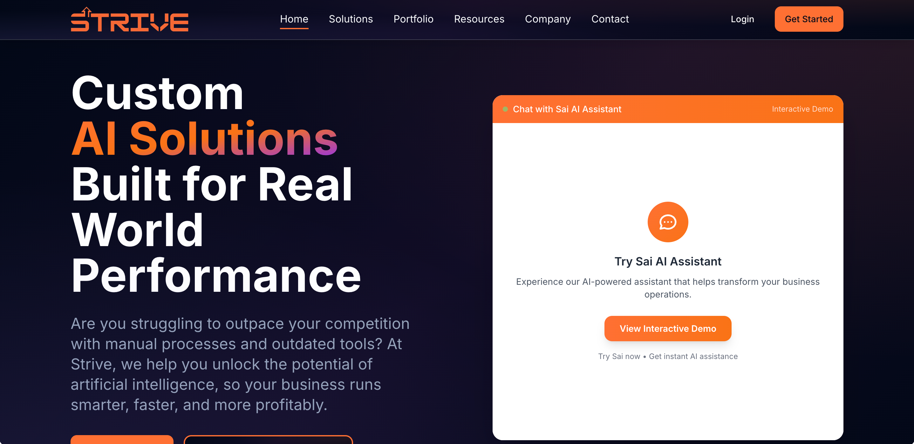

# Last Update Sessions

# 2 

Remove the Featured Whitepaper Section from all pages except for the initial Resources page where all resource cards are being shown and the Whitepaper filtered page

# All above has been "completed" -> Just needs review #

# 3

Update all sources for case studies

Create full pages for case studies - currently linked through the "sources" section on pop-out cards
    - Create "view full case study" button for users to see full case study in pop-out card
    - Make sure ALL case studies are actually relevant to the industry theyre linked to (check government and legal - one of the two current case study articles isn't linked to industry)
    - Validate all case study links (use claude walkthrough folders/files and perplexity to validate)
Change generic stock photos that don't match topics or categories (some cards still don't have photos)

# 4

Upload Whitepaper and finish resource page feature section

Make sure email templates are good to go and database is fully operational on all form submissions

# Chat bot fixes (in other dev environment)

IMPORTANT -> Start making industry specific demos and subdomains so people can see the demo in their specific industry

Chat bot project - Fix chatbot CTA buttons to take users to the request page or assessment pages (Add a calendly option at the end of contact form which appears after the user has submitted the contact form) - Need to change one of the CTA buttons to "Request Showcase" which takes the user to the request page

Fix homepage chatbot window to be smaller and to fit on all screens and devices

Fix home page hero section chatbot iframe (currently way too small and is not formatted correctly for all devices)

Fix chatbot-sai page, the window is small on laptop so try to make sure it's formatted/configured properly on all devices

Change Chatbot-sai page to have chatbot be the center focus and maybe take out the hero section?
# Final fixes

Please go through all solutions and make adjustments, some of them need to be switched out (we currently have robotics -_-) 
    - After doing this we need to make sure that all industries have the right number of applicable solutions attached to them and the number is being shown in the dropdown filter
    - Pivot and make sure Solutions cards are made for specific industries (3 each) - Can still be categorized by solution type
    - Edit Industry cards to where the pop-out activates when the main button is pushed (the 3-4 solutions that are specific to that industry -> maybe even have the 3-4 industry specific solutions as the badges on the industry cards) -> Currently, you can only see the pop-out cards by clicking the industry overview badge (which I kinda like)

Change home page hero section for mobile to where the main header text is above the chatbot preview window
Make sure mobile is completely optimized with all new content

Refactor entire codebase for easier maintenance. This is essential for when the site is converted to next.js and the user side is put into the site

# POSSIBLE MASSIVE PIVOT -> Cater everything to the Intelligent Assistant (ChatBot) by wording everything as tools which act as add ons/attachements, even though everything else is still their own solution / solution type, the intelligent assistant is the main marketing and sale point that we can speak on consistently. This also allows us to make an app/platform for the Assistant (and Strive) where all clients can access and manage their Assistants and or tools.
    - This assistant can be a chatbot, extra team member, sales lead generator, lead marketer, security specialist, etc. 
    - This allows us continue doing what we're doing but be more precise on how we market ourselves.
    - Solution types stays and then we put the "tools" into each solution type
    - Take this into accont for the dropdown menu on the solutions page how all of the "solution" cards will be changed to tools -> See if we need to update the Solution Types in order to take this pivot into account

# Device Specific Formatting #

- Laptop home screen formatting

